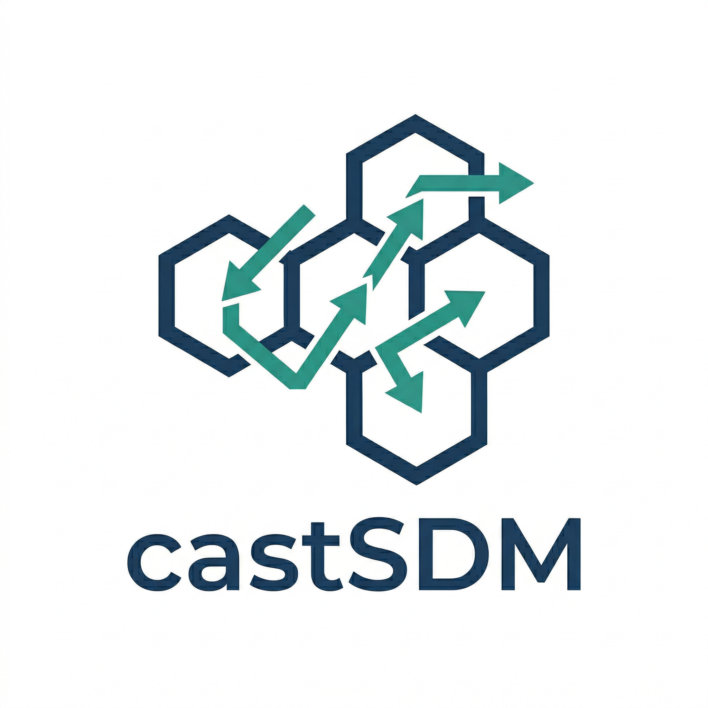

# castSDM 

<!-- badges: start -->
[](https://github.com/EldonQ/castSDM/actions/workflows/R-CMD-check.yaml)
[](https://www.gnu.org/licenses/gpl-3.0)
<!-- badges: end -->

**castSDM** (**C**ausal **S**tructure-informed **S**pecies **D**istribution **M**odeling) bridges causal inference and species distribution modeling. It discovers causal relationships among environmental predictors, quantifies their effects on species occurrence, and builds causally-informed predictive models for habitat suitability mapping.

## Installation

```r
# From GitHub
pak::pak("EldonQ/castSDM")

# Or with devtools
devtools::install_github("EldonQ/castSDM")
```

## Pipeline

| Step | Function | Description |
|-----:|----------|-------------|
| 0 | `cast_vif()` | VIF-based collinearity screening |
| 1 | `cast_prepare()` | Data validation & train/test split |
| 2 | `cast_dag()` | Causal DAG learning (bootstrap HC, PC, BiDAG, NOTEARS) |
| 3 | `cast_ate()` | Double ML ATE estimation with FDR correction |
| 3b | `cast_evalue()` | E-value sensitivity analysis for unmeasured confounding |
| 3c | `cast_backdoor()` | Backdoor criterion identifiability check |
| 4 | `cast_screen()` | Adaptive variable screening |
| 5 | `cast_roles()` | Causal role assignment |
| 6 | `cast_features()` | Causal feature engineering |
| 7 | `cast_fit()` | Model fitting (CI-MLP / RF / MaxEnt / BRT) |
| 8 | `cast_evaluate()` | Hold-out evaluation (AUC, TSS, CBI, SEDI, PRAUC) |
| 8b | `cast_cv()` | Spatial K-fold cross-validation |
| 9 | `cast_predict()` | Spatial habitat suitability prediction |
| 10 | `cast_cate()` | Conditional ATE mapping via causal forests |
| — | `cast_consistency()` | Inter-model spatial consistency |
| — | `cast_shap_xgb()` | XGBoost SHAP interpretation |
| — | `cast_shap_fit()` | SHAP for fitted RF / CI-MLP models |
| — | `cast_uncertainty()` | MC Dropout uncertainty quantification |
| — | `cast_report()` | HTML report generation |

All steps are available through the unified `cast()` pipeline or as standalone functions.

## Quick Start

```r
library(castSDM)
data(ovis_ammon)
data(china_env_grid)

# One-step pipeline
result <- cast(
  species_data = ovis_ammon,
  env_data     = china_env_grid,
  models       = c("cast", "rf", "maxent", "brt")
)

summary(result)
plot(result)
```

## Step-by-Step Usage

```r
library(castSDM)
data(ovis_ammon)
data(china_env_grid)

split  <- cast_prepare(ovis_ammon, train_fraction = 0.7, seed = 42)
dag    <- cast_dag(split$train, R = 100, seed = 42)
ate    <- cast_ate(split$train, K = 5, seed = 42)
evalue <- cast_evalue(ate)
screen <- cast_screen(dag, ate, split$train)
roles  <- cast_roles(screen, dag)

fit  <- cast_fit(split$train, screen = screen, dag = dag, ate = ate,
                 models = c("cast", "rf"))
eval <- cast_evaluate(fit, split$test)
pred <- cast_predict(fit, china_env_grid)
cate <- cast_cate(split$train, ate = ate, screen = screen,
                  predict_data = china_env_grid, seed = 42)

# Plotting
plot(dag, roles = roles, screen = screen)
plot(ate)
plot(screen)
plot(eval)
plot(pred, model = "rf", basemap = "china")
plot(cate, hss_predict = pred, hss_model = "rf", hss_threshold = 0.1)
```

## Key Features

- **Four DAG learners** — bootstrap Hill-Climbing, PC, BiDAG BGe, and NOTEARS (torch)
- **Double Machine Learning** — ATE estimation with Benjamini-Hochberg FDR correction
- **E-value sensitivity** — robustness to unmeasured confounding
- **Backdoor criterion** — identifiability verification via DAG structure
- **Causal feature engineering** — ATE-weighted variables + DAG interaction terms
- **CI-MLP architecture** — neural network embedding causal knowledge (focal loss, residual blocks, cosine annealing)
- **Multi-model comparison** — CI-MLP, Random Forest, MaxEnt, BRT in one pipeline
- **Spatial cross-validation** — grid/cluster blocking for honest evaluation
- **CATE mapping** — spatially heterogeneous treatment effects via causal forests with HSS masking
- **SHAP interpretation** — TreeSHAP (XGBoost) and model-agnostic (fastshap) for RF/CI-MLP
- **MC Dropout uncertainty** — prediction confidence maps
- **Publication-quality figures** — terra-interpolated spatial heatmaps, DAG networks, consistency matrices

## Example Data

| Dataset | Description |
|---------|-------------|
| `ovis_ammon` | Argali (*Ovis ammon*) presence/background on ISEA3H Res-9 grid, China |
| `china_env_grid` | Full environmental grid at matching resolution |

See `inst/examples/` for worked examples: `run_ovis_ammon.R`, `run_multi_species.R`, `run_lota_lota.R`.

## Dependencies

**Imports**: `cli`, `grid`, `scales`

**Suggests** (installed as needed):

| Purpose | Packages |
|---------|----------|
| DAG | `bnlearn`, `BiDAG`, `torch`, `igraph`, `ggraph` |
| Models | `ranger`, `maxnet`, `gbm`, `torch` |
| CATE | `grf` |
| SHAP | `xgboost`, `fastshap` |
| Plots | `ggplot2`, `patchwork`, `sf`, `terra`, `viridisLite` |
| Evaluation | `pROC` |

## Citation

```bibtex
@software{castSDM,
  author  = {Liqiang},
  title   = {castSDM: Causal Structure-Informed Species Distribution Modeling},
  year    = {2026},
  url     = {https://github.com/EldonQ/castSDM},
  version = {0.1.0}
}
```

## License

GPL (>= 3)
# castSDM 

<!-- badges: start -->
[](https://github.com/EldonQ/castSDM/actions/workflows/R-CMD-check.yaml)
[](https://www.gnu.org/licenses/gpl-3.0)
<!-- badges: end -->

**castSDM** (Causal Structure-informed Species Distribution Modeling)
integrates causal inference methods with species distribution modeling
(SDM), enabling researchers to learn species-specific causal structures,
estimate variable-level causal effects, and build causally-informed
predictive models for habitat suitability mapping.

## Motivation

Traditional SDMs rely on correlative associations between species
occurrences and environmental predictors, making them vulnerable to
spurious correlations and poor transferability under novel conditions.
**castSDM** addresses these limitations by:

- Discovering causal structure among predictors via **Directed Acyclic
  Graphs (DAGs)** (bootstrap Hill-Climbing, PC, BiDAG BGe MAP, or
  linear NOTEARS with optional **torch**)
- Quantifying causal effect sizes through **Double Machine Learning
  (DML)** based Average Treatment Effect (ATE) estimation
- Engineering ecologically interpretable features guided by causal
  theory
- Training **Causally-Informed Multi-Layer Perceptrons (CI-MLP)** that
  embed causal knowledge into model architecture
- Mapping **spatially heterogeneous treatment effects (CATE)** via
  causal forests, with optional **HSS-based masking** on maps
- **XGBoost + SHAP** summaries (`cast_shap_xgb`, `plot.cast_shap`) for
  interpretability on the same presence ~ environment design matrix

## Installation

Install the development version from GitHub:

``` r
# install.packages("pak")
pak::pak("EldonQ/castSDM")
```

Or using `devtools`:

``` r
# install.packages("devtools")
devtools::install_github("EldonQ/castSDM")
```

## Quick Start

``` r
library(castSDM)

# Load example data
data(ovis_ammon)
data(china_env_grid)

# One-step pipeline (optional DAG / NOTEARS args — see ?cast)
result <- cast(
  species_data = ovis_ammon,
  env_data     = china_env_grid,
  models       = c("cast", "rf", "maxent", "brt"),
  dag_structure_method = "bootstrap_hc"  # or "pc", "bidag_bge", "notears_linear"
)

summary(result)
plot(result)
```

## Pipeline Overview

The **castSDM** workflow consists of modular steps, each accessible as a
standalone function:

| Step | Function           | Description                           |
|-----:|--------------------|---------------------------------------|
|    0 | `cast_vif()`       | VIF-based collinearity screening      |
|    1 | `cast_prepare()`   | Data validation and train/test split  |
|    2 | `cast_dag()`       | Causal DAG learning (see `structure_method`) |
|    3 | `cast_ate()`       | DML-based ATE estimation              |
|    4 | `cast_screen()`    | Adaptive variable screening           |
|    5 | `cast_roles()`     | Causal role assignment                |
|    6 | `cast_features()`  | Causal feature engineering            |
|    7 | `cast_fit()`       | Model fitting (CI-MLP / RF / MaxEnt / BRT) |
|    8 | `cast_evaluate()`  | Hold-out evaluation (AUC, TSS, CBI, SEDI, Kappa, PRAUC) |
|    8b| `cast_cv()`        | Spatial K-Fold cross-validation       |
|    9 | `cast_predict()`   | Spatial habitat suitability prediction|
|   10 | `cast_cate()`      | Spatially heterogeneous CATE mapping  |
|   — | `cast_consistency()` / `plot()` | Inter-model spatial consistency heatmaps |
|   — | `cast_shap_xgb()` / `plot.cast_shap()` | XGBoost SHAP network & waterfall |

All steps are also available through the unified `cast()` function.
Multi-species batches: `cast_batch()` runs the same pipeline per species into
separate folders; use `fit_verbose` for `cast_fit()` logging (not `verbose` in
`...`, which would clash with the batch driver’s `verbose`). See
`inst/examples/run_multi_species.R`.

## Step-by-Step Usage

``` r
library(castSDM)
data(ovis_ammon)

# 1. Data preparation
split <- cast_prepare(ovis_ammon, train_fraction = 0.7, seed = 42)

# 2. DAG learning (default: bootstrap HC; try structure_method = "pc", etc.)
dag <- cast_dag(split$train, R = 100, seed = 42,
                structure_method = "bootstrap_hc")

# 3. ATE estimation
ate <- cast_ate(split$train, K = 2, seed = 42)

# 4. Variable screening
screen <- cast_screen(dag, ate, split$train)

# 5. Causal role assignment
roles <- cast_roles(screen, dag)

# 6. Model fitting
fit <- cast_fit(split$train, screen = screen, dag = dag, ate = ate,
                models = c("cast", "rf"))

# 7. Evaluation
eval <- cast_evaluate(fit, split$test)
print(eval)

# 8. Spatial CV (optional, recommended)
cv <- cast_cv(ovis_ammon, screen = screen, dag = dag, ate = ate,
              k = 5, models = c("rf"))

# 9. Prediction
data(china_env_grid)
pred <- cast_predict(fit, china_env_grid)
plot(pred, model = "cast", basemap = "china")

# 10. CATE estimation + optional HSS mask on the map (e.g. suitability >= 0.1)
cate <- cast_cate(split$train, ate = ate, screen = screen, top_n = 3,
                  predict_data = china_env_grid, seed = 42)
plot(cate, hss_predict = pred, hss_model = "cast", hss_threshold = 0.1)

# SHAP (requires xgboost)
if (requireNamespace("xgboost", quietly = TRUE)) {
  sh <- cast_shap_xgb(split$train, screen = screen, seed = 42)
  plot(sh, type = "interaction_network", top_n = 15)
  plot(sh, type = "waterfall", top_n = 15)
}
```

## Key Features

- **Causal inference integration**: DAG structure learning and DML-ATE
  estimation provide an ecologically grounded variable selection and
  feature engineering framework.
- **Several DAG learners**: `cast_dag(..., structure_method = )` supports
  `"bootstrap_hc"`, `"pc"` (**bnlearn**), `"bidag_bge"`
  (**BiDAG**), and `"notears_linear"` (**torch**).
- **Multi-model comparison**: Fit CI-MLP alongside Random Forest,
  MaxEnt, and BRT within the same pipeline for fair benchmarking.
- **Spatial cross-validation**: Spatially blocked K-Fold CV with grid or
  cluster blocking strategies for honest evaluation under spatial
  autocorrelation.
- **Inter-model consistency plots**: `plot.cast_consistency()` with
  publication-style defaults (tunable fonts and colour bar layout).
- **Rich S3 methods**: `print()`, `summary()`, and `plot()` methods for
  every pipeline output, enabling rapid visual exploration.
- **Modular design**: Use individual functions for fine-grained control,
  or `cast()` for an end-to-end workflow.

## Example Data

The package includes two built-in datasets:

- **`ovis_ammon`**: Presence/background data for Argali (*Ovis ammon*)
  on the ISEA3H Res-9 hexagonal grid across China, with 19 bioclimatic
  variables.
- **`china_env_grid`**: Full environmental grid covering China at the
  same resolution, for spatial prediction.

Further examples live under `inst/examples/` (e.g. `run_ovis_ammon.R`,
`run_lota_lota.R`, `replot_model_consistency_from_rds.R`).

## Dependencies

Hard **Imports** include `cli`, `coro`, `data.table`, `grid`, `rlang`,
`scales`. Extended functionality uses **Suggests**:

- **DAG**: `bnlearn`, `BiDAG` (BiDAG path), `igraph`, `ggraph`, `torch`
  (NOTEARS path)
- **Models**: `ranger` (RF), `maxnet` (MaxEnt), `gbm` (BRT), `torch`
  (CI-MLP)
- **CATE**: `grf` (causal forests)
- **SHAP**: `xgboost`
- **Plotting**: `ggplot2`, `patchwork`, `sf`, `terra`, `viridisLite`
- **Evaluation**: `pROC`

## Building & checking (vignettes and Pandoc)

The package ships an **R Markdown** vignette (`vignettes/castSDM.Rmd`).
When you run a full **`R CMD build`** (or `devtools::check()` with
default vignette rebuilding), R rebuilds that vignette, which requires
**Pandoc** (and usually **rmarkdown**) on your machine. If Pandoc is not
installed, the build step fails with a clear error.

Earlier checks may not have mentioned Pandoc because:

1. **Check options differ**: `devtools::check(vignettes = FALSE)` or
   `R CMD check --no-build-vignettes` skips rebuilding vignettes, so
   Pandoc is never invoked.
2. **CI vs local**: GitHub Actions runners typically include Pandoc, so
   the badge workflow can pass even when a local Windows install lacks
   it.
3. **First-time full build**: A plain `devtools::check()` without those
   flags triggers a full source build including vignettes — that is when
   the Pandoc requirement appears.

To check without Pandoc locally (recommended mirror of a lean CI run):

``` r
devtools::check("path/to/cast", vignettes = FALSE,
                  args = c("--no-manual", "--no-build-vignettes"))
```

From a shell (example R 4.4.3 on Windows):

``` text
"D:\R\R-4.4.3\bin\Rscript.exe" -e "devtools::check('e:/Package/cast', vignettes=FALSE, args=c('--no-manual','--no-build-vignettes'))"
```

To enable full checks: install [Pandoc](https://pandoc.org/installing.html)
and ensure `rmarkdown` is available.

## Citation

If you use **castSDM** in your research, please cite:

``` bibtex
@software{castSDM,
  author = {Liqiang},
  title = {castSDM: Causal Structure-Informed Species Distribution Modeling},
  year = {2026},
  url = {https://github.com/EldonQ/castSDM},
  version = {0.1.0}
}
```

## License

GPL (\>= 3)
