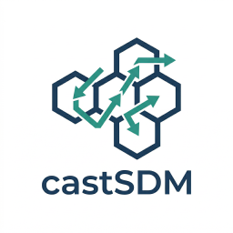

# castSDM 

<!-- badges: start -->
[](https://github.com/EldonQ/castSDM/actions/workflows/R-CMD-check.yaml)
[](https://www.gnu.org/licenses/gpl-3.0)
<!-- badges: end -->

castSDM (Causal-Aware Species Distribution Modeling) integrates explicit ecological role assumptions with fast covariate selection and standard species distribution models. The validated default restricts ranking to predeclared direct candidates and records why every other variable was excluded.

The package is a causal-aware screening toolkit, not proof of causal mechanisms from observational data. Causal interpretation is conditional on the reviewed role specification. DAG, Markov Blanket, and data-only invariant outputs remain optional diagnostics and comparison paths.

## What castSDM Does

- Creates a conservative, editable causal-role table with `cast_causal_spec()`.
- Excludes `mediator`, `proxy_only`, `sampling_bias`, `adjustment_only`, and `unknown` variables from the causal core.
- Ranks direct candidates with a 100-tree RF, cross-environment invariance, conditional evidence, and redundancy control.
- Returns the selected causal core together with the complete role, score, and exclusion audit.
- Provides response-focused DAG and MB learning when a separate structural diagnostic is needed.
- Fits RF, BRT, MaxEnt, and GAM models, then evaluates them with AUC, TSS, and CBI.
- Supports spatial block cross-validation, performance-weighted ensembles, future projections, raster prediction, and optional CATE estimation.
- Scales from one-species workflows with `cast()` to multi-species workflows with `cast_batch()` and checkpointed resume.

## Installation

```r
# install.packages("pak")
pak::pak("EldonQ/castSDM")

# or
# install.packages("devtools")
devtools::install_github("EldonQ/castSDM")
```

For a full workflow, install the optional backends you plan to use:

```r
install.packages(c(
  "car", "bnlearn", "BiDAG", "ranger", "gbm", "maxnet", "mgcv",
  "pROC", "ggplot2", "patchwork", "sf", "terra", "future",
  "future.apply", "grf", "ggraph", "igraph", "viridisLite",
  "yaml", "peakRAM"
))
```

## Pipeline

```r
species_data + env_data
       |
  cast_prepare()          # train/test split
       |
  cast_causal_spec()      # reviewed ecological role assumptions
       |
  cast_select()           # role-constrained causal-core ranking
       |
  screen$scores           # complete role and exclusion audit
       |
  cast_fit()              # RF, BRT, MaxEnt, GAM
       |
  cast_cv()               # spatial block cross-validation
       |
  cast_evaluate()         # hold-out AUC, TSS, CBI
       |
  cast_predict()          # habitat suitability maps
       |
  cast_ensemble()         # weighted / best / equal ensemble
       |
  cast_project()          # future climate range change
       |
  cast_cate() [optional]  # CATE via causal forests
```

## Workflow at a Glance

| Stage | Main functions | Purpose |
|-------|----------------|---------|
| Utility | `get_env_vars()`, `cast_vif()` | Detect environmental predictors and optionally remove severe collinearity |
| Preparation | `cast_prepare()` | Validate data and create train/test splits |
| Causal specification | `cast_causal_spec()` | Declare and review role eligibility before selection |
| Variable screening | `cast_select()` | Select an auditable causal core within the eligible role set |
| Structural diagnostics | `cast_dag()` | Optionally learn a response-focused DAG or MB screening graph |
| Fitting and evaluation | `cast_fit()`, `cast_evaluate()`, `cast_cv()` | Fit RF/BRT/MaxEnt/GAM and evaluate transferability |
| Rare species | `cast_esm()` | Ensemble of Small Models fallback for low-presence species |
| Spatial outputs | `cast_predict()`, `cast_predict_tiled()` | Map habitat suitability in memory or tile by tile |
| Ensemble and projection | `cast_ensemble()`, `cast_project()` | Ensemble suitability and future range change |
| Raster workflows | `cast_load_bioclim()`, `cast_background()`, `cast_ensemble_raster()`, `cast_project_raster()` | Raster-native sampling, prediction, and projection |
| CATE | `cast_cate()` | Spatially heterogeneous treatment effects with MB-guided covariates |
| Wrappers | `cast()`, `cast_batch()`, `cast_batch_resume()` | One-species or multi-species end-to-end workflows |
| Config-driven | `cast_run_from_config()`, `cast_config_template()` | Drive a batch from a YAML file |
| Parallelism | `cast_worker_budget()` | Allocate workers across species and intra-species stages |

## Model and Screening Options

### Fitted models

- `rf`: Random Forest via `ranger`.
- `brt`: Boosted Regression Trees via `gbm`.
- `maxent`: MaxEnt via `maxnet`.
- `gam`: Generalized Additive Model via `mgcv`.
- `esm`: Ensemble of Small Models for rare species.

### Variable screening

- `causal_prior_rf`: validated default. Role-constrained shallow RF, invariance and conditional-evidence ranking with a full audit.
- `invariant_screen`: data-only spatial-invariance ablation.
- `rf`: pure RF/stability ablation with redundancy control.
- `mb_rf`: compatibility path for earlier Markov Blanket plus RF workflows.

### DAG and MB learners

- `mb_first`: two-stage MB discovery plus local PC; available for audit and legacy screening.
- `pc`: constraint-based PC algorithm.
- `bootstrap_hc`: bootstrap-aggregated score-based DAG learning.
- `bidag_bge`: Bayesian MAP search via BiDAG.

## Dependency Notes

Hard imports are intentionally small: `cli` and `grid`. Extended functionality is activated through suggested packages.

| Purpose | Packages |
|---------|----------|
| Collinearity | `car` |
| DAG / graph tools | `bnlearn`, `BiDAG`, `igraph`, `ggraph`, `pcalg` |
| Model fitting | `ranger`, `gbm`, `mgcv`, `maxnet` |
| Evaluation | `pROC` |
| CATE | `grf` |
| Spatial / plotting | `ggplot2`, `patchwork`, `sf`, `terra`, `viridisLite` |
| Parallel execution | `future`, `future.apply`, `pkgload` |
| Config | `yaml` |
| Resource monitoring | `peakRAM` |
| Vignettes | `rmarkdown`, `knitr` |

Functions that rely on optional packages emit informative errors if the required backend is not installed.

## Interpretation Guidance

- Role declarations are ecological priors and must be reviewed before analysis.
- Only `direct_candidate` variables can enter the default causal core; omission from a user specification fails closed to `unknown`.
- The RF and invariance scores rank eligible variables but do not create causal eligibility.
- DAG and Markov Blanket outputs are data-informed structural hypotheses, not confirmed mechanisms.
- CATE estimates remain conditional on measured covariates and model assumptions.

## Citation

```bibtex
@software{castSDM,
  author  = {Liqiang Q},
  title   = {castSDM: Causal-Aware Species Distribution Modeling},
  year    = {2026},
  url     = {https://github.com/EldonQ/castSDM},
  version = {0.4.0}
}
```

## License

GPL (>= 3)
